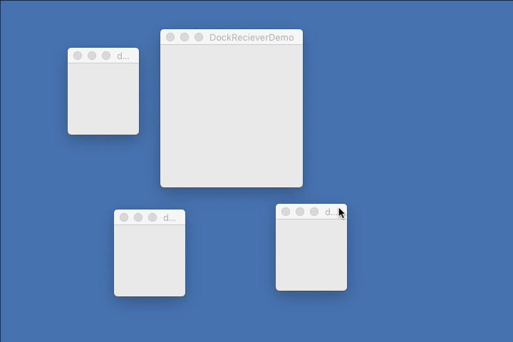

# README

## (THIS IS STILL WORK IN PROGRESS)

## I — Why?
This project is an experimental extension of Apple’s Cocoa wrapper called Vanilla. Author of this project is a coder and type designer that misses docking functionality in font editor apps like RoboFont or Glyphs. In Robofont author spends too much time on going through many opened windows, floating around. Even if he does his best, the desktop looks like a mess while working. In Glyphs (in which this project mostly won’t work, since it has been written in objective c) he thinks that the arrangement of the windows and tabs is too fixed. Therefore the “virtual workspace” and the workflow variations are strongly influenced and limited by GlyphApp’s creators.

## II — What are the docking windows?
Docking window gives a possibility of glueing two or more windows together. It helps the user in arranging and managing his or her workspace. It is the most democratic aspect of UI :).

// [docking example in PyQt](https://camo.githubusercontent.com/d055041fec6aa38079ae1a4dc58c8b7a49a8677a/68747470733a2f2f66696c65732e6769747465722e696d2f6a7570797465722d776964676574732f4c6f6262792f30626a692f646f636b617265612e676966)

## III — Requirements
```
python 3.6
python libraries:
vanilla, PyObjC
```
## IV — The vocabulary of this project
Docking Window:
> Window with docking abilities, it is any vanilla Window object passed to the WindowDockReciever in the list.

windowDockReciever.WindowDockReciever:
> Special object that is a child of Vanilla Window. It receives the docking windows (it is used like a `docking interface`, while the whole docking process is happening inside the `views.AbstractDockingGroup`)

dockingSplitView.DockingSplitView:
> Custom Split view that can dynamically set the `paneDescription`

views.AbstractDockingGroup
> The most important view that manages the docking windows. Its functionality depends on windowDockReciever.WindowDockReciever

views.EmptyDockingGroup
> Empty group that fills up parent view ( the `posSize` is set to `(0, 0, -0, -0)`. It is a child of views.AbstractDockingGroup.

views.LoadedDockingGroup
> This view represents Docking Window that has been already docked to its receiver. It has special title bar with `undock` button. It is a child of views.EmptyDockingGroup a grandchild of views.AbstractDockingGroup.

dockingWindowList.DockingWindowList
> object that imitates python’s default list objects, that contains docking windows. It dynamically binds windows’ move event with the WindowDockReciever’s `_dockingWindowMoveCallback`

Docking Group:
> views.AbstractDockingGroup or views.EmptyDockingGroup or views.LoadedDockingGroup

Docking Position:
> position where docking window is going to be docked (it can be `left`, `right`, `top` and `bottom`)

Docking Side:
> one of the four NSViews/vanilla.Groups attributes in the AbstractDockingGroup, that represents docking position. When one of the docking windows is above them, they turn their color, so the user can see to which position the window is going to be attached.

Docking Direction:
> direction of the docking of one split view segment: it can be `horizontal` or `vertical`.


---

> // Author’s side notes and small comments are preceded by double slash `//`

---


## VI — How does this thing work?

#### VI a — WindowDockReciever’s interface:

```python
from vanilla import *
from lib.windowDockReciever import WindowDockReciever
from lib.test.testTools import executeVanillaTest


class DemoDocking:
    def __init__(self):
        self.dockingWindow1 = Window((100, 100, 100, 100), "dockingWindow1")
        self.dockingWindow1.open()

        self.dockingWindow2 = Window((100, 300, 100, 100), "dockingWindow2")
        self.dockingWindow2.open()

        self.dockingWindow3 = Window((100, 500, 100, 100), "dockingWindow3")
        self.dockingWindow3.open()
        
        self.normalWindow = Window((100, 500, 100, 100), "normalWindow")
        self.normalWindow.open()

        dockingWindows = [
            self.dockingWindow1,
            self.dockingWindow2,
            self.dockingWindow3
        ]

        self.dockReciever = WindowDockReciever((250, 200, 200, 200),
                                               title="DockRecieverDemo", dockingWindows=dockingWindows, minSize=(200,200))
        self.dockReciever.open()

executeVanillaTest(DemoDocking)
```


The only difference between initialising the WindowDockReciever and vanilla.Window objects is that the first one receives an additional parameter, ‘dockingWindows’. It is a list of vanilla.Window objects that are going to be included in docking operation. Windows outside the list (like `normalWindow` in the example above) won’t be attached to WindowDockReciever object.

#### VI b — User Experience


#### VI c — What is happening?
1. When WindowDockReciever is being initialised, it creates:\
	- `self._content` attribute (which is an instance of **EmptyDockingGroup** class). This attribute will later handle the docking.
	
	 - `self.dockingWindows`  attribute (instance of **DockingWindowList**) absorbs dockingWindows parameter. It automatically binds each window in the list to the 'move' event. The event tracks the position of the windows on the screen. The move event is bonded to **WindowDockReciever._dockingWindowMoveCallback**.

	- `self.dockedWindows` attribute — an empty list, that later will be populated with vanilla.Window objects that have been docked. It will be used later to open the vanilla.Window objects, when the undock button will be hit.

	- event monitor for `mouseUp` event to track when dockingWindow stopped moving

2. **WindowDockReciever._dockingWindowMoveCallback** tracks position of the moved windows by a user, to determine whenever the window is on top of the one of the `self._content`’s docking sides:

	- it calls `self._content.isWindowOnDockingSide` method which receives moved *dockingWindow* as a parameter.


	- `self._content.isWindowOnDockingSide` returns dockingGroup to which passed *dockingWindow* has been docked and *dockingPostion* — string describing to which Docking Side the *dockingWindow* is going to be attached.
	
	- setting `self.currentlyDockingWinodow_Position` to the tuple that contains *dockingWindow*, *dockintPosition* and *dockingGroup*

---

2. a. how `self._content.isWindowOnDockingSide` (`AbstractDockingGroup.isWindowOnDockingSide`) is working
	- it takes the *dockingWindow*\

	- it calculates the middle point of *dockingWindow’s* title bar\

	- based on the position of the title bar’s middle point it does the `hitTest`  (`NSView.hitTest_`) against every docking side that belongs to the `self`.\

	- if the `hitTest` returns anything (meaning: if the title bar is on top of one of the sides of the WindowDockReciver), the docking side view turns the color (becomes visible to the user as a orange rectangle)

	- the method returns the `postion` which has one of the following string values: `'top'`, `'bottom'`, `'left'`, `'right'`, and self which is one of WindowDockReciver’s docking groups
---

3. Releasing left mouse button starts `WindowDockReciever._mouseUp` method, which:

	- runs `WindowDockReciever._dockWindow` that takes elements of the `self.currentlyDockingWinodow_Position` generated previously in `WindowDockReciever._dockingWindowMoveCallback` method.

	- it resets elements of `self.currentlyDockingWinodow_Position` to `None`

---

3. a. how `WindowDockReciever._dockWindow` is working
	- it takes *dockingWindow*, *position*, and *dockingGroup* as the parameters

	- it stops working if the *position* parameter is None: it means that the *dockingWindow* is not on the top of any docking side

	- it makes sure that: 
		- the *dockingWindow* is vanilla.Window object
		- the *dockingWindow* was passed to the ‘WindowDockReciever’ as an element of *dockingWindows* list
		- the *dockingWindow* hasn’t been docked yet
	- it transfers every Vanilla GUI element of the *dockingWindow* to the `WindowDockReciever` by creating the `LoadedDockingGroup` instance called *loadedWindow*.
	- it adds the *dockingWindow* to the *self.dockedWindows* attribute, to make sure, that later it will be easy to undock it
	- it closes the *dockingWindow* and unbinds its move event

---


---
## AUTHOR COMMENTS
I should make docking more flexible. For now only one dockGroup responses to docking. I did it just to test if the idea makes sense (AND HURRAY! IT LOOKS IT DOES!).

## TODO
- undocking
- central docking/creating tabs
- closing already docked windows
- dictionary with info about docking behaviour instead of list with windows
- after I’m done with prototyping I should figure out how autosaveName. I have no idea how to start this 

#### dictionary
| key            | value                     |
|:--             |:--                        |
| window         | `Vanilla.Window` instance |
|  size          | (`w`, `h`)                |
| allowPositions | ( `"top"`/`"bottom"`/`"left"`/`"right"`/`"every"` combination of those ) |
| minSize        | (`w`, `h`)                |
| maxSize        | (`w`, `h`)                |